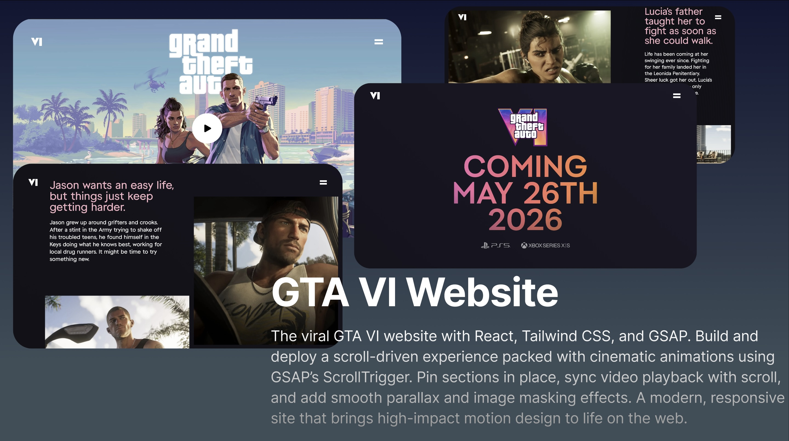

<p align="center">
  
  
  
</p>

---

## 🎮 GTA VI Motion Experience Website

A cinematic scroll-motion website inspired by Rockstar’s GTA VI announcement style — built to explore animation-first interactions, scroll-triggered storytelling, and synchronized media playback.

---

## 🧠 Why I Built This

I didn’t want to create a typical static UI — I wanted something that **moves**, feels **cinematic**, and reacts to scrolling the way game reveal trailers unfold.

This project challenged me to explore:

- Motion-driven UX  
- Scroll-based animation timing  
- Smooth parallax depth  
- Balancing visuals and performance  
- GSAP timeline sequencing and optimization  

---

## 🎬 Key Motion Features

- 🎥 **Scroll-synchronized video playback**
- 🧲 **Pinned motion sections**
- 🌫 **Multi-layer parallax scrolling**
- ⚡ **Lazy-loaded media for smooth performance**
- 🎨 **Neon cyber-cinematic visual theme**

---

## 📚 What I Learned

- ScrollTrigger requires planning — not random easing  
- Animation performance impacts perceived UX  
- Mobile breakpoints need unique motion logic  
- Parallax + synchronized playback feels cinematic when balanced  

---

## ⭐ If You Like This Project

Show support by giving the repo a **⭐ star** — it helps more developers discover it.

---

## 🤝 Contributions

PRs are welcome for:

- Motion sequencing ideas  
- Performance tuning  
- Alternative timeline experiments  

---

## ⚡ Setup & Installation

```bash
# Clone the repo
git clone https://github.com/shekhar566/GTA_6_landing

# Go to project folder
cd GTA_6_landing

# Install dependencies
npm install

# Start development
npm run dev
